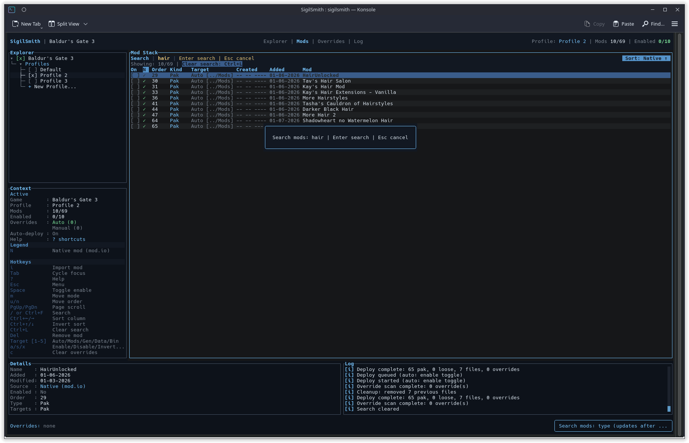
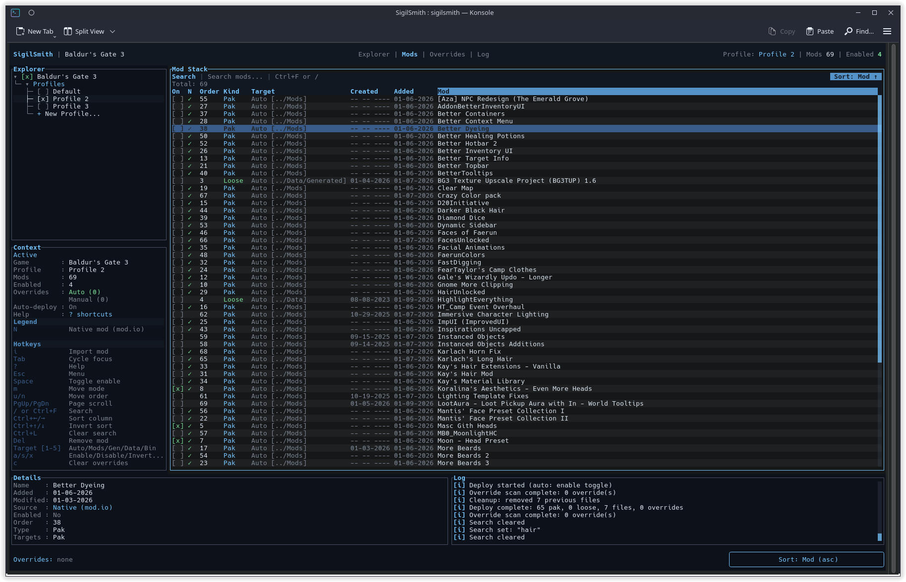
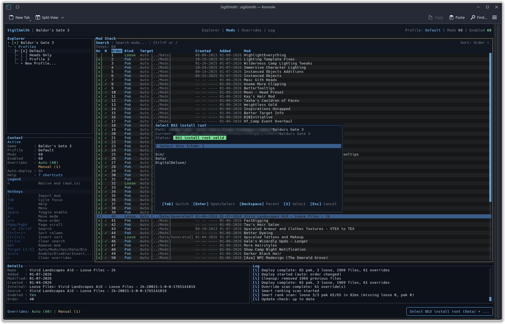

# SigilSmith

SigilSmith is a Linux-first TUI mod manager for Baldur's Gate 3. It focuses on native file-based mod deployment:

- `.pak` mods -> `~/.local/share/Larian Studios/Baldur's Gate 3/Mods`
- Loose files -> `Baldur's Gate 3/Data/Generated` or `Baldur's Gate 3/Data`
- Bin overrides -> `Baldur's Gate 3/bin`

Multi-game support is coming next via an open adapter template (BG3-first today, more games soon).

## Screenshots








## Highlights

- Drag & drop `.zip/.7z/.pak` or folders; automatic target detection.
- SigiLink cache with hardlink/symlink deploys (no full copies).
- SigiLink Intelligent Ranking with pins, diffs, and safe auto-runs.
- Mod list interop: JSON export/import + modsettings.lsx export/import.
- Overrides panel for fast conflict resolution with inline winners.
- Missing mod placeholders + dependency dialogs to keep order clean.
- Native mod.io entries alongside manual installs.
- Auto-update checks with clear release notes.

## What's New (0.5.0+)

- SigiLink cache: transactional imports, hardlink/symlink deploy, and cache tools.
- SigiLink Intelligent Ranking: onboarding, pins, auto-rank, and clear diff views.
- Mod list interop: JSON + modsettings.lsx import/export with preview.
- Dependency UX: confirm enable/disable cascades and missing file prompts.
- D/Dep column counts: missing vs disabled dependencies in one glance.
- Better TUI: aligned panels, wider settings, richer help, and cleaner overlays.

Creator note: I worked tirelessly day and night on the new SigiLink cache and ranking
system, chasing edge cases and polishing the UX. This release is finally ready, and
I have more planned snapshots (and a few secrets) for the next release.

## Requirements

- Rust (stable toolchain)
- BG3 installed (Steam native or Proton)

## Install

Prebuilt Linux packages are published on GitHub Releases (AppImage, `.deb`, `.rpm`, and `.tar.gz`).
See `docs/INSTALL.md` for the full install guide.

## Source & Releases

The public repository includes the full source and CI release workflow. Release artifacts
are built by GitHub Actions from signed tags, and every release includes checksums.

### From Source

```bash
cargo build --release
./target/release/sigilsmith
```

To build AppImage/.deb/.rpm/.tar.gz packages, use `./packaging/build-packages.sh`.

## Run (Dev)

```bash
cargo run
```

## Keybinds

- `Tab` cycle focus (Explorer/Mods/Overrides/Log)
- `Enter` select/expand in Explorer
- `a` new profile (Explorer)
- `r` or `F2` rename profile (Explorer)
- `c` duplicate profile (Explorer)
- `e` export mod list (Explorer)
- `p` import mod list (Explorer)
- `i` import a mod (file, folder, zip, or 7z)
- drag & drop into the terminal to import (whole window)
- `space` enable/disable (Mods)
- `m` move mode
- `u` move up
- `n` move down
- `Ctrl+E` export mod list
- `Ctrl+P` import mod list
- `Ctrl+R` restore SigiLink ranking for selected mod
- `1` override: Auto (default target selection)
- `2` override: Pak
- `3` override: Generated
- `4` override: Data
- `5` override: Bin
- `Left/Right` cycle overrides (Overrides)
- `Up/Down` choose winner (Overrides)
- `Backspace` clear conflict override (Overrides)
- `PgUp/PgDn` scroll log
- `Esc` settings menu (SigiLink, confirmations, configure paths, keybinds)
- `b` rollback last backup
- `Del` remove mod from library
- `d` deploy to game
- `q` quit

## Docs

- `docs/INSTALL.md` install options and packages
- `docs/RELEASE.md` release checklist and build steps
- `docs/PUBLISH.md` publishing to mod sites
- `docs/SUPPORT.md` donation options and setup

## Support

Support links (Ko-fi + GitHub Sponsors) are coming next update.

## Credits

- saghm for the `larian_formats` crate used for BG3 LSPK + modsettings parsing.

## License & Trademarks

SigilSmith is source-available and permission is required to use, copy, modify, or
distribute it, including for any commercial or paid use. Contact Agistaris for
licensing. The SigilSmith name and logo are trademarks of Agistaris; see
`TRADEMARKS.md` for details.

## Library Location

SigilSmith keeps its mod library here:

```
~/.local/share/sigilsmith/Baldur's Gate 3/
```

## Notes

- Importing copies mod files into the library.
- Deploy writes `modsettings.lsx` and merges loose files in the profile order (last wins).
- Deploy uses the SigiLink cache and hardlink/symlink targets (no full-copy fallback).
- Each deploy snapshots `library.json`, `deploy_manifest.json`, and `modsettings.lsx` under `backups/`.

## Config

SigilSmith stores per-game config at:

```
~/.local/share/sigilsmith/Baldur's Gate 3/config.json
```

Global app config (active game) lives at:

```
~/.local/share/sigilsmith/config.json
```

On first launch SigilSmith auto-detects your BG3 paths. If it cannot find them,
open the menu with `Esc` and choose "Configure game paths".
You can also edit the config files directly if BG3 is installed in a non-standard path.

If auto-detect fails, SigilSmith opens a path browser. Use arrows to navigate,
Enter to open/select, Backspace to go up, Tab to edit the path, and S to select
the current folder.
