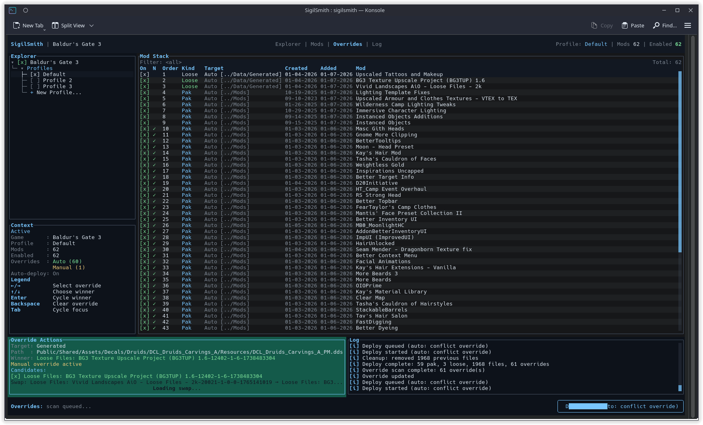
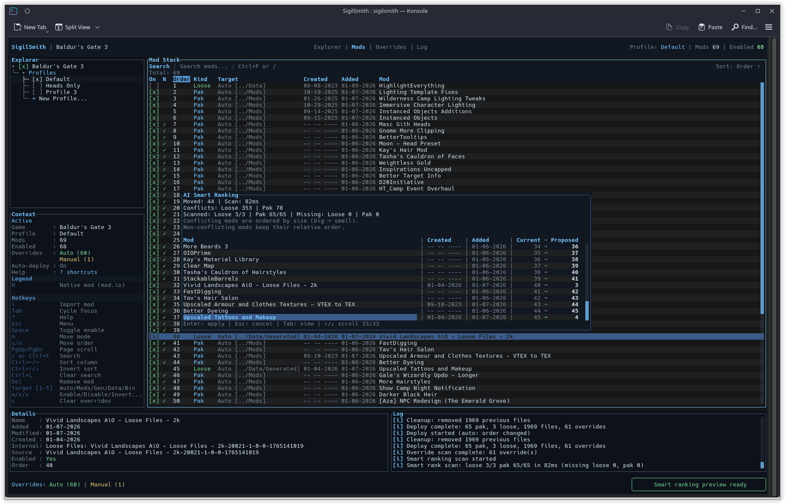
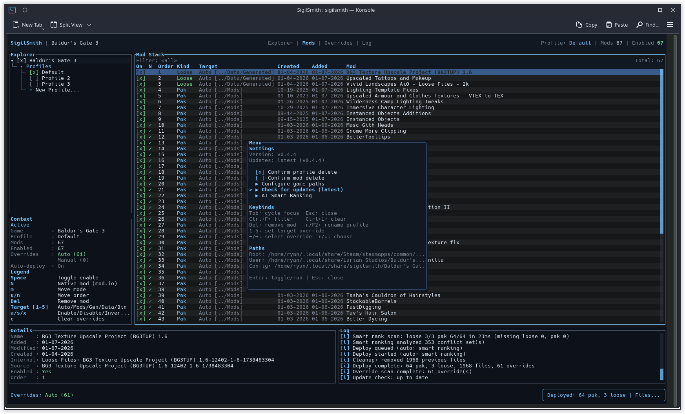
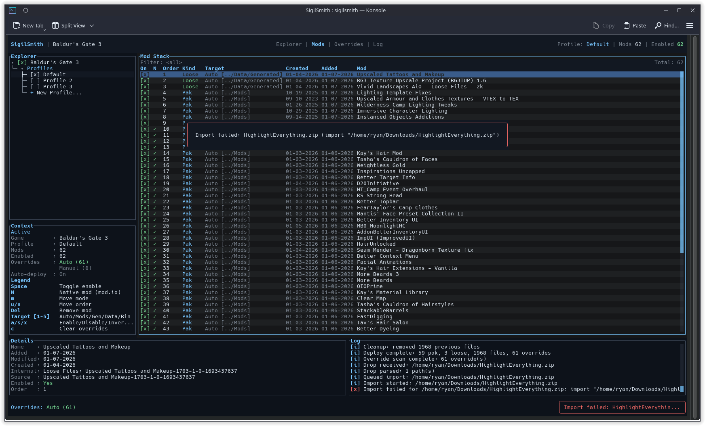

# SigilSmith

SigilSmith is a Linux-first TUI mod manager for Baldur's Gate 3. It focuses on native file-based mod deployment:

- `.pak` mods -> `~/.local/share/Larian Studios/Baldur's Gate 3/Mods`
- Loose files -> `Baldur's Gate 3/Data/Generated` or `Baldur's Gate 3/Data`
- Bin overrides -> `Baldur's Gate 3/bin`

Multi-game support is coming next via an open adapter template (BG3-first today, more games soon).

## Screenshots







## Highlights

- Drag & drop `.zip/.7z/.pak` or folders; automatic target detection.
- Profiles + load order with deterministic override rules (last wins).
- Override Actions panel with debounced swap overlay for manual conflict picks.
- AI Smart Ranking preview (diff view + scroll) to suggest a stable order.
- Created/Added dates from meta.lsx/info.json for better ordering heuristics.
- Native mod.io entries show inline and can be managed alongside manual mods.

## Requirements

- Rust (stable toolchain)
- BG3 installed (Steam native or Proton)

## Install

Prebuilt Linux packages are published on GitHub Releases (AppImage, `.deb`, `.rpm`, and `.tar.gz`).
See `docs/INSTALL.md` for the full install guide.

## Source & Releases

The public repository includes the full source and CI release workflow. Release artifacts
are built by GitHub Actions from signed tags, and every release includes checksums.

### From Source

```bash
cargo build --release
./target/release/sigilsmith
```

To build AppImage/.deb/.rpm/.tar.gz packages, use `./packaging/build-packages.sh`.

## Run (Dev)

```bash
cargo run
```

## Keybinds

- `Tab` cycle focus (Explorer/Mods/Overrides/Log)
- `Enter` select/expand in Explorer
- `a` new profile (Explorer)
- `r` or `F2` rename profile (Explorer)
- `c` duplicate profile (Explorer)
- `e` export profile (Explorer)
- `p` import profile list (Explorer)
- `i` import a mod (file, folder, zip, or 7z)
- drag & drop into the terminal to import (whole window)
- `space` enable/disable (Mods)
- `m` move mode
- `u` move up
- `n` move down
- `1` override: Auto (default target selection)
- `2` override: Pak
- `3` override: Generated
- `4` override: Data
- `5` override: Bin
- `Left/Right` cycle overrides (Overrides)
- `Up/Down` choose winner (Overrides)
- `Backspace` clear conflict override (Overrides)
- `PgUp/PgDn` scroll log
- `Esc` settings menu (AI Smart Ranking, confirmations, configure paths, keybinds)
- `b` rollback last backup
- `Del` remove mod from library
- `d` deploy to game
- `q` quit

## Docs

- `docs/INSTALL.md` install options and packages
- `docs/RELEASE.md` release checklist and build steps
- `docs/PUBLISH.md` publishing to mod sites
- `docs/SUPPORT.md` donation options and setup

## Support

Support links (Ko-fi + GitHub Sponsors) are coming next update.

## License & Trademarks

SigilSmith is licensed under Apache-2.0. The SigilSmith name and logo are trademarks of
Agistaris; see `TRADEMARKS.md` for details.

## Library Location

SigilSmith keeps its mod library here:

```
~/.local/share/sigilsmith/Baldur's Gate 3/
```

## Notes

- Importing copies mod files into the library.
- Deploy writes `modsettings.lsx` and merges loose files in the profile order (last wins).
- Deploy records all files it copies in `deploy_manifest.json` so it can clean up before the next deploy.
- Each deploy snapshots `library.json`, `deploy_manifest.json`, and `modsettings.lsx` under `backups/`.

## Config

SigilSmith stores per-game config at:

```
~/.local/share/sigilsmith/Baldur's Gate 3/config.json
```

Global app config (active game) lives at:

```
~/.local/share/sigilsmith/config.json
```

On first launch SigilSmith auto-detects your BG3 paths. If it cannot find them,
open the menu with `Esc` and choose "Configure game paths".
You can also edit the config files directly if BG3 is installed in a non-standard path.

If auto-detect fails, SigilSmith opens a path browser. Use arrows to navigate,
Enter to open/select, Backspace to go up, and S to select the current folder.
