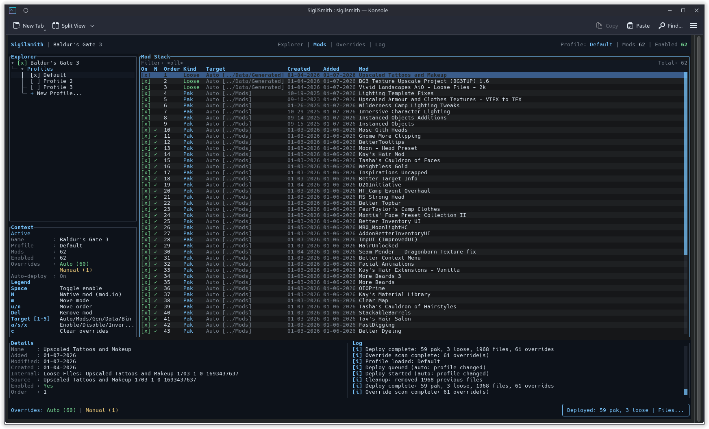
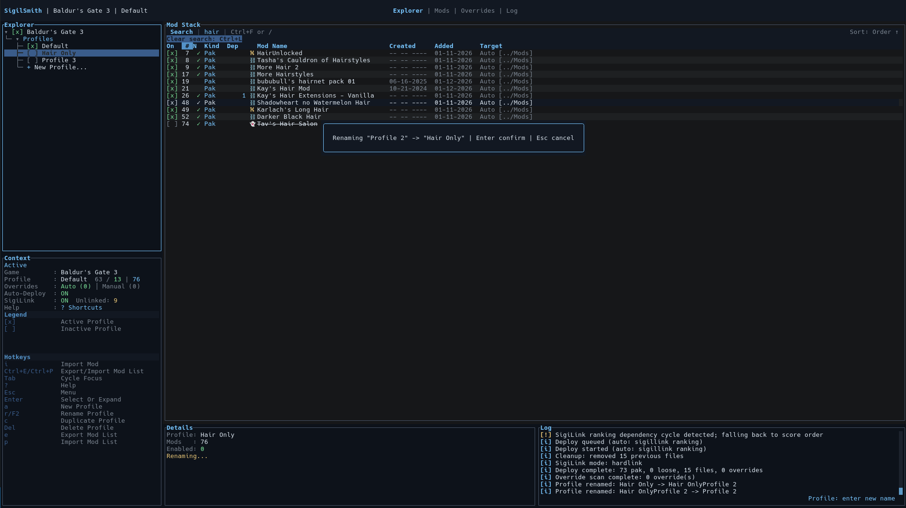
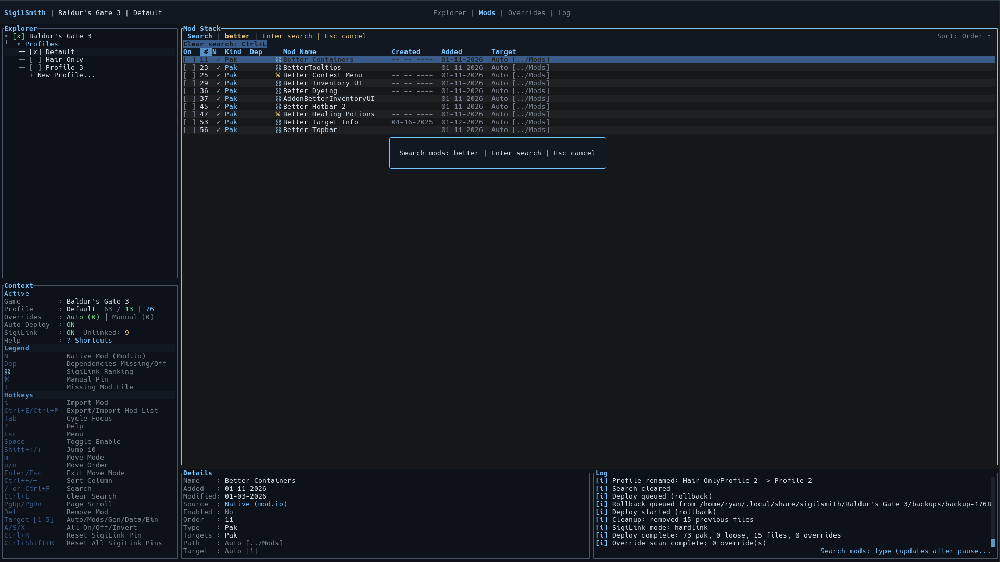
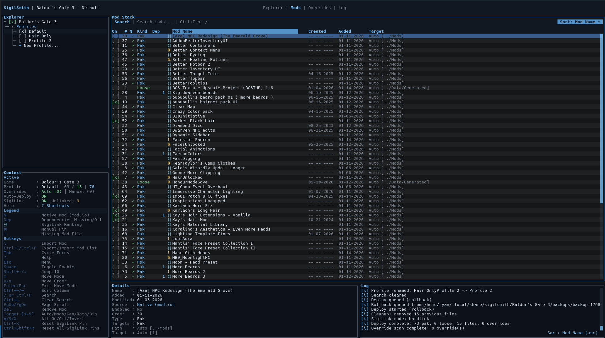
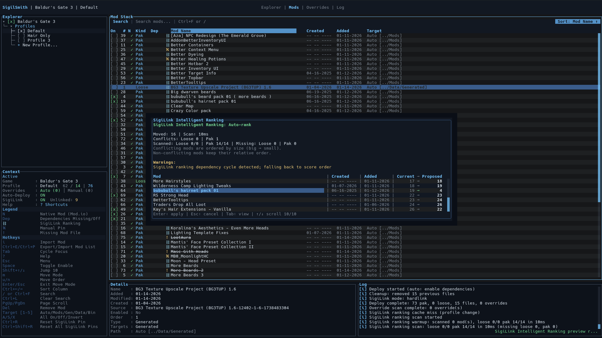
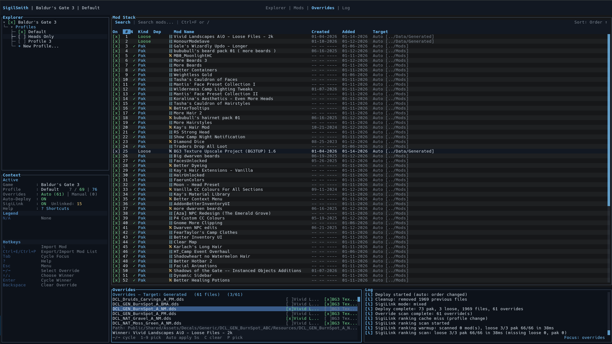
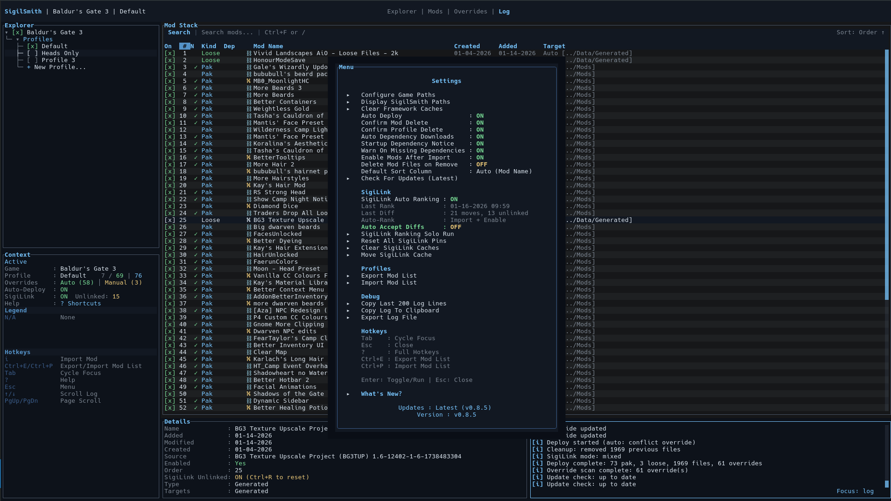
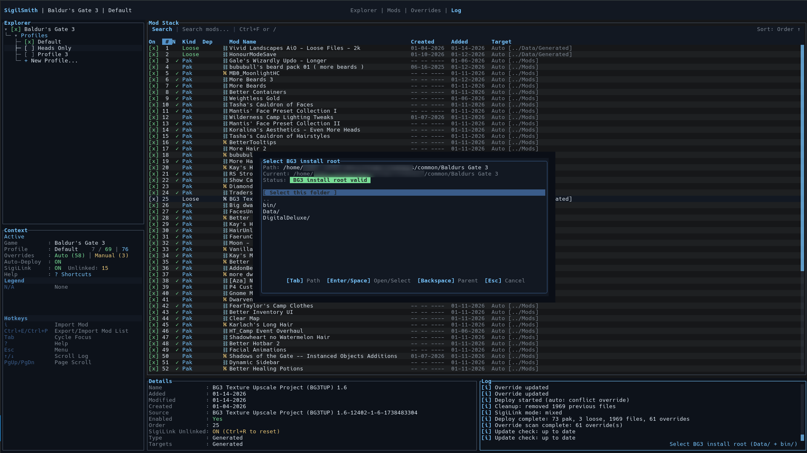
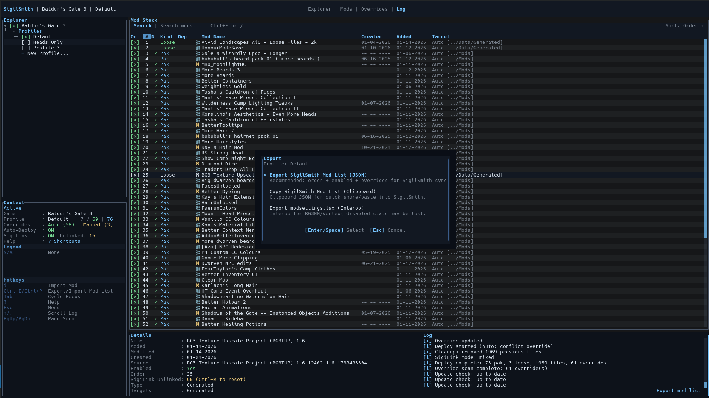
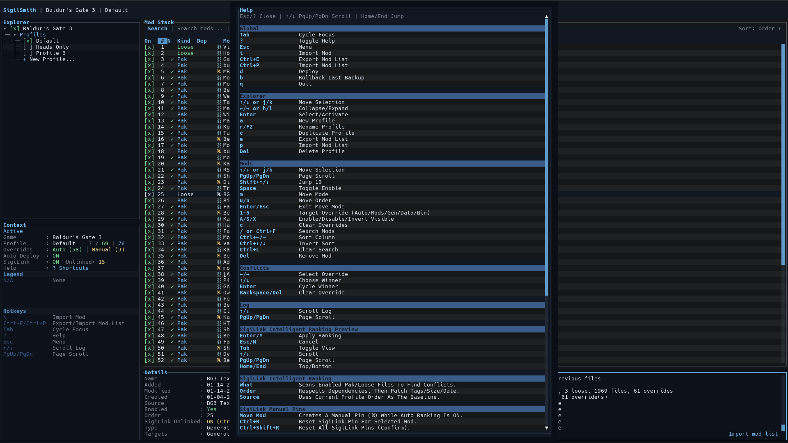

# SigilSmith

SigilSmith is a keyboard-first, Linux-first TUI mod manager for Baldur's Gate 3. Drag-drop imports, profiles,
overrides, SigiLink cache deploys, and intelligent ordering in one place. It focuses on native file-based mod
deployment:

- `.pak` mods -> `~/.local/share/Larian Studios/Baldur's Gate 3/Mods`
- Loose files -> `Baldur's Gate 3/Data/Generated` or `Baldur's Gate 3/Data`
- Bin overrides -> `Baldur's Gate 3/bin`

Multi-game support is coming next via an open adapter template (BG3-first today, more games soon).

## Screenshots

### Overview


### Explorer + Profiles


### Mod Stack Search


### Mod Stack Sorting


### SigiLink Intelligent Ranking


### Overrides


### Settings


### Directory Select


### Mod List Export


### Help / Shortcuts


## Highlights

- Drag & drop `.zip/.7z/.pak` or folders; automatic target detection.
- SigiLink cache with hardlink/symlink deploys (no full copies).
- Auto deploy (debounced) with a manual deploy escape hatch.
- SigiLink Intelligent Ranking with onboarding, unlinked pins, and diff previews.
- Mod list interop: JSON (full fidelity) + modsettings.lsx (interop).
- Overrides panel for fast conflict resolution with inline winners.
- Missing mod placeholders + dependency dialogs to keep order clean.
- Native mod.io entries alongside manual installs.
- Auto-update checks with clear release notes.
- Fast, readable TUI layout with clear focus states and full-width striping.

## What's New (0.5.0 → 0.9.0)

### SigiLink Cache + Deploy
- Transactional imports with staging + safe cancel.
- Hardlink/symlink deploys (no full-copy fallback) with cache relocation.
- Clear cache tools for safe recovery and refresh.

### SigiLink Intelligent Ranking
- Onboarding, auto-ranking after import/enable, and solo runs.
- Unlinked pins with reset hotkeys and clearer diff previews.
- Auto-accept diffs option for hands-off ordering.

### Mod List Interop
- JSON export/import with order + enabled state + overrides.
- modsettings.lsx import/export for BG3MM/Vortex workflows.
- Preview modal with missing/ambiguous handling.

### UX + Workflow
- Override panel redesign for fast conflict resolution.
- Dependency dialogs for enable/disable cascades.
- Cleaner layout, help, and export/import flows.

Creator note: I worked tirelessly day and night on the new SigiLink cache and ranking
system, chasing edge cases and polishing the UX. This release is finally ready, and
I have more planned snapshots (and a few secrets) for the next release.

## How It Works

### Library vs Deploy
Imports go into the SigilSmith library first. Deploy writes modsettings.lsx and
places files into the game directories in profile order. You can deploy manually
with `d`, or enable auto deploy (debounced) so changes apply automatically.

### SigiLink Cache
SigiLink keeps a cache for fast deploys using hardlinks (same drive) or symlinks
(different drives). No copy fallback is used. You can move or clear the cache in
Settings when you need a clean refresh.

### SigiLink Intelligent Ranking
When enabled, SigiLink auto-ranks mods after imports or enables, using heuristics
that consider relevance and conflicts. Manual moves create “unlinked” pins so
SigiLink respects your chosen positions until you reset them.

### Mod List Import/Export
SigilSmith JSON is full fidelity (order + enabled + overrides). modsettings.lsx
is for interop with other managers, but it cannot represent disabled state.
All imports show a preview before apply.

### Overrides
The overrides panel lets you choose the winning mod per file quickly. Changes
queue a conflict scan and deploy (if auto deploy is enabled).

### Missing Mods / Ghost Entries
Missing files are kept as “ghost” entries so profile order stays intact. SigilSmith
shows a clear missing-mod dialog and offers Nexus search links to re-import.

## Requirements

- BG3 installed (Steam native or Proton)
- Linux terminal (Konsole, GNOME Terminal, etc.)

## Install

Prebuilt Linux packages are published on GitHub Releases (AppImage, `.deb`, `.rpm`, and `.tar.gz`).
See `docs/INSTALL.md` for the full install guide.

## Source & Releases

The public repository includes the full source and CI release workflow. Release artifacts
are built by GitHub Actions from signed tags, and every release includes checksums.

### From Source

Requires the Rust stable toolchain.

```bash
cargo build --release
./target/release/sigilsmith
```

To build AppImage/.deb/.rpm/.tar.gz packages, use `./packaging/build-packages.sh`.

## Run (Dev)

```bash
cargo run
```

## Keybinds

- `Tab` cycle focus (Explorer/Mods/Overrides/Log)
- `Enter` select/expand in Explorer
- `a` new profile (Explorer)
- `r` or `F2` rename profile (Explorer)
- `c` duplicate profile (Explorer)
- `e` export mod list (Explorer)
- `p` import mod list (Explorer)
- `i` import a mod (file, folder, zip, or 7z)
- drag & drop into the terminal to import (whole window)
- `space` enable/disable (Mods)
- `m` move mode
- `u` move up
- `n` move down
- `Ctrl+E` export mod list
- `Ctrl+P` import mod list
- `Ctrl+R` restore SigiLink ranking for selected mod
- `F12` reset all SigiLink pins
- `1` override: Auto (default target selection)
- `2` override: Pak
- `3` override: Generated
- `4` override: Data
- `5` override: Bin
- `Left/Right` cycle overrides (Overrides)
- `Up/Down` choose winner (Overrides)
- `Backspace` clear conflict override (Overrides)
- `PgUp/PgDn` scroll log
- `Esc` settings menu (SigiLink, confirmations, configure paths, keybinds)
- `b` rollback last backup
- `Del` remove mod from library
- `d` deploy to game
- `q` quit

## Docs

- `docs/INSTALL.md` install options and packages
- `docs/RELEASE.md` release checklist and build steps
- `docs/release_body.md` release body template

## Support

Support links (Ko-fi + GitHub Sponsors) are coming next update.

## Credits

- saghm for the `larian_formats` crate used for BG3 LSPK + modsettings parsing.

## License & Trademarks

SigilSmith is source-available under the SigilSmith Community License v1.0. You
may use and modify it for personal or internal, non-commercial use, but you may
not redistribute modified copies or offer hosted/commercial services without
permission. Contact Agistaris for licensing. The SigilSmith name and logo are
trademarks of Agistaris; see `TRADEMARKS.md` for details.

## Library Location

SigilSmith keeps its mod library here:

```
~/.local/share/sigilsmith/Baldur's Gate 3/
```

## Notes

- Importing copies mod files into the library.
- Deploy writes `modsettings.lsx` and merges loose files in the profile order (last wins).
- Deploy uses the SigiLink cache and hardlink/symlink targets (no full-copy fallback).
- Each deploy snapshots `library.json`, `deploy_manifest.json`, and `modsettings.lsx` under `backups/`.

## Config

SigilSmith stores per-game config at:

```
~/.local/share/sigilsmith/Baldur's Gate 3/config.json
```

Global app config (active game) lives at:

```
~/.local/share/sigilsmith/config.json
```

On first launch SigilSmith auto-detects your BG3 paths. If it cannot find them,
open the menu with `Esc` and choose "Configure game paths".
You can also edit the config files directly if BG3 is installed in a non-standard path.

If auto-detect fails, SigilSmith opens a path browser. Use arrows to navigate,
Enter to open/select, Backspace to go up, Tab to edit the path, and S to select
the current folder.
